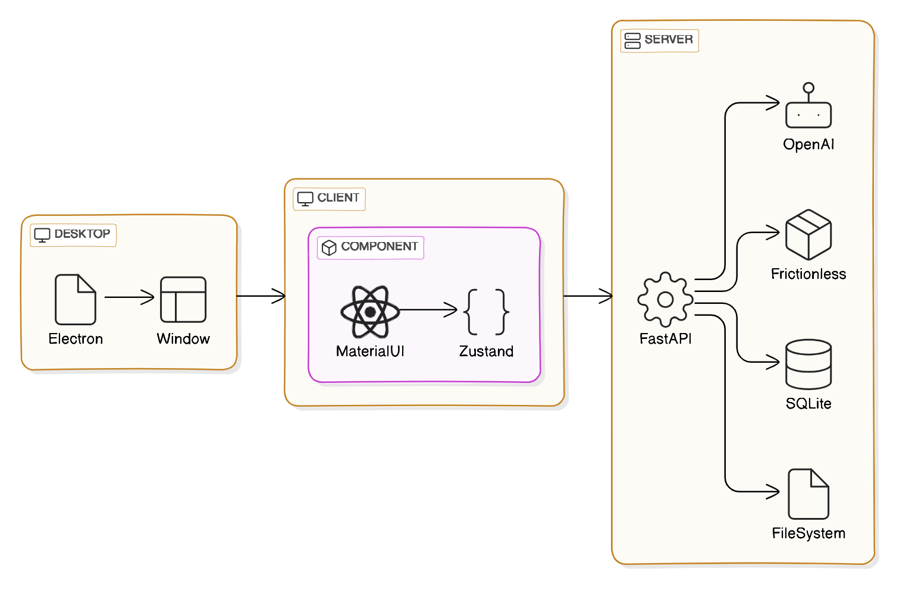

This document describes the architecture of the Open Data Editor project.

## Components

High-level design of the Open Data Editor project is shown in the diagram below. The project consists of the following components:

- **Desktop**: The desktop app component is responsible for providing a desktop application for the Open Data Editor project.
- **Client**: The client component is responsible for rendering the user interface and sending requests to the server.
- **Server**: The server component is responsible for handling requests from the client and interacting with the file system, database, and local or remote services.

### Desktop

The desktop component is built using the Electron framework. It provides a desktop application for the Open Data Editor project. The desktop component is responsible for starting the client and server components and managing their lifecycle, as well as environment management i.e. installing Python dependencies. This component is the tiniest part of the project and it is not required to be used for local development as the client and server components can be run independently.

The main technologies used in the client component are:

- TypeScript
- Electron
- Electron Builder

#### Main Process

The main process is responsible for starting the client and server components and managing their lifecycle. It is also responsible for environment management i.e. installing Python dependencies. As in any Electron app, the main process is the entry point of the application and is responsible for creating the application window.

#### Renderer Process

The renderer process is responsible for rendering the user interface and sending requests to the server. It is built using React and communicates with the server using REST APIs.

#### Context Bridge

The context bridge is a feature of Electron that allows the renderer process to securely communicate with the main process. It is used to send messages between the renderer process and the main process. The only functionality that the client uses from the Electron native interfaces:

- getting a server port
- opening a project directory
- communicating fatal errors

### Client

The client component is responsible for rendering the user interface and sending requests to the server. It is built using React and communicates with the server using REST APIs.

The main technologies used in the client component are:

- TypeScript
- React
- MaterialUI
- Zustand
- Inovua
- Monaco
- Leaflet
- Vega

#### Application

#### Controllers

#### Editors

#### Views

#### Parts

### Server

The server component is responsible for handling requests from the client and interacting with the file system, database, and local or remote services. It is built using FastAPI and communicates with the client using REST APIs.

The main technologies used in the server component are:

- Python
- FastAPI
- SQLAlchemy
- TinyDB
- Frictionless
- OpenAPI
