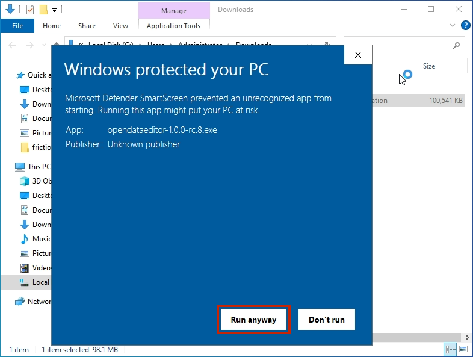
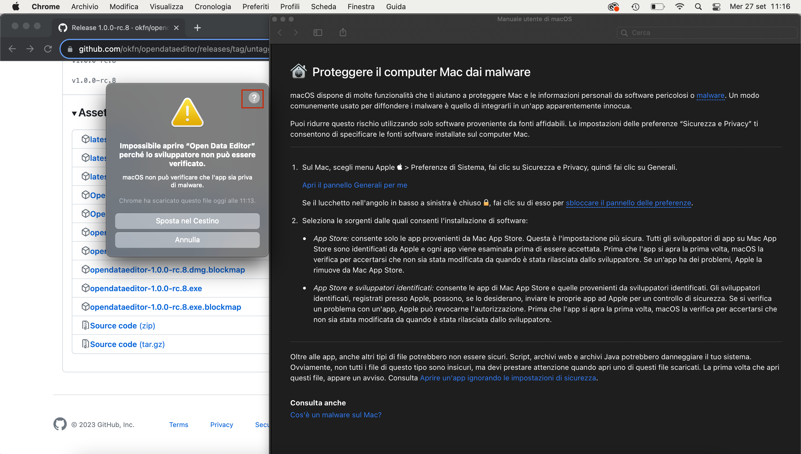

The Open Data Editor (ODE) is a tool for non-technical data practitioners to explore and detect errors in tables. It also allows users to publish data on GitHub, Zenodo and CKAN portals.

ODE is powered by [Frictionless](https://framework.frictionlessdata.io/), a toolkit created by the Open Knowledge Foundation (OKFN) to help data practitioners find errors in data in an easier way.

In October 2023, the OKFN team released a beta version of the ODE for early adopters. Since then, and thanks to the support of [McGovern Foundation](https://www.mcgovern.org/), in March 2024 our team started working on a new product vision for the app which focused on reducing the number of features available to users to transform the app into a validation tool for tables.

This user guide has been updated to adapt its content for the ODE pre-release in September 2024.

:::tip
Please be aware that our team is working on making improvements to the ODE for its stable release in December 2024. Therefore, you may encounter some actions that are not performing as expected. If you come across such issues, please let us know by creating an [issue on GitHub](https://github.com/okfn/opendataeditor/issues/new) or [sending us an email](mailto:info@okfn.org).
:::

## How to download and install the app

To download the ODE app, please, [click here](https://github.com/okfn/opendataeditor/releases)

Open Data Editor is available on all major platforms:
- **For Windows**: Download the most recent **EXE file**.
- **For MacOS**: Download the most recent **DMG file**.
- **For Linux**: Download the most recent **AppImage or DEB file**.

## Windows

Go to the [RELEASES](https://github.com/okfn/opendataeditor/releases) and download the most recent **EXE** file.

1. If you receive the following message click `Continue download`

2. After downloading, double click to run the app. You may encounter the security message window, click `More info` and proceed.

3. Click `Run anyway` to run the application.

## MacOS

Go to the [RELEASES](https://github.com/okfn/opendataeditor/releases) and download the most recent **DMG** file.

1. If you encounter a security message, click on the question mark and then click the link in the first section.

2. Change settings to allow the app to execute.

## Linux

For Linux, there are two options available:

- AppImage (for any distributions)
- deb (for Ubuntu/Debian)

### Any Distribution

Go to the [RELEASES](https://github.com/okfn/opendataeditor/releases) and download the most recent **AppImage** file. After downloading, you have to make it executable:

Then double-click on the file to start the application.

### Ubuntu/Debian

Go to the [RELEASES](https://github.com/okfn/opendataeditor/releases) and download the most recent **DEB** file. Double click on the file and it will initiate the installation process.

After installation, you can use it.

