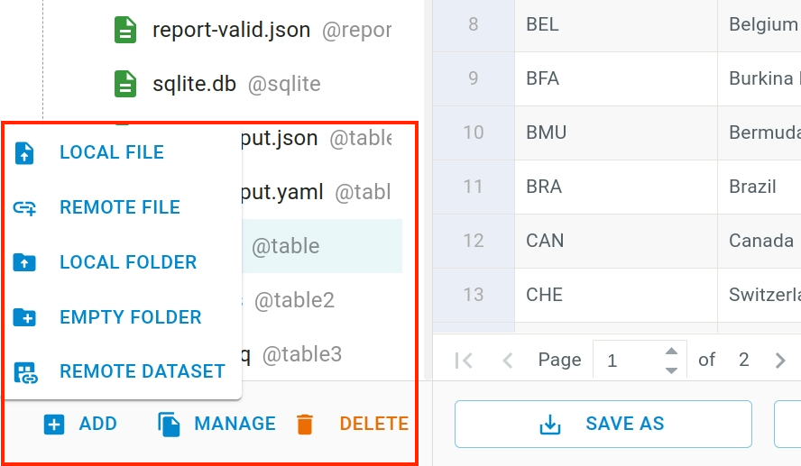
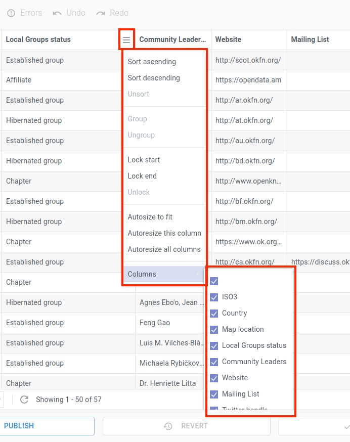
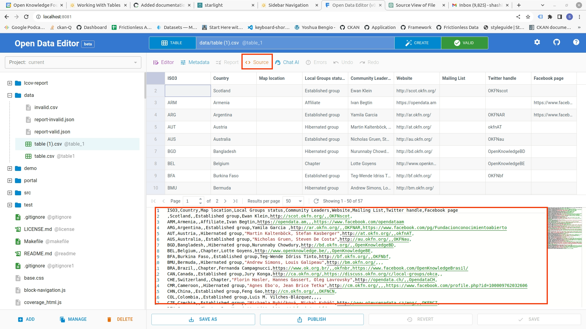
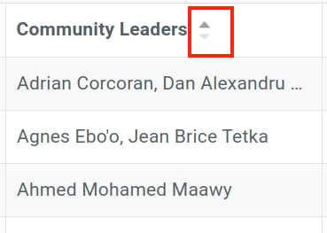
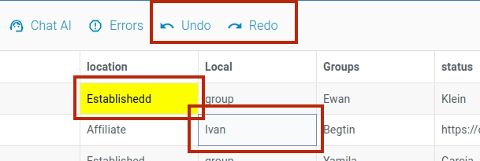
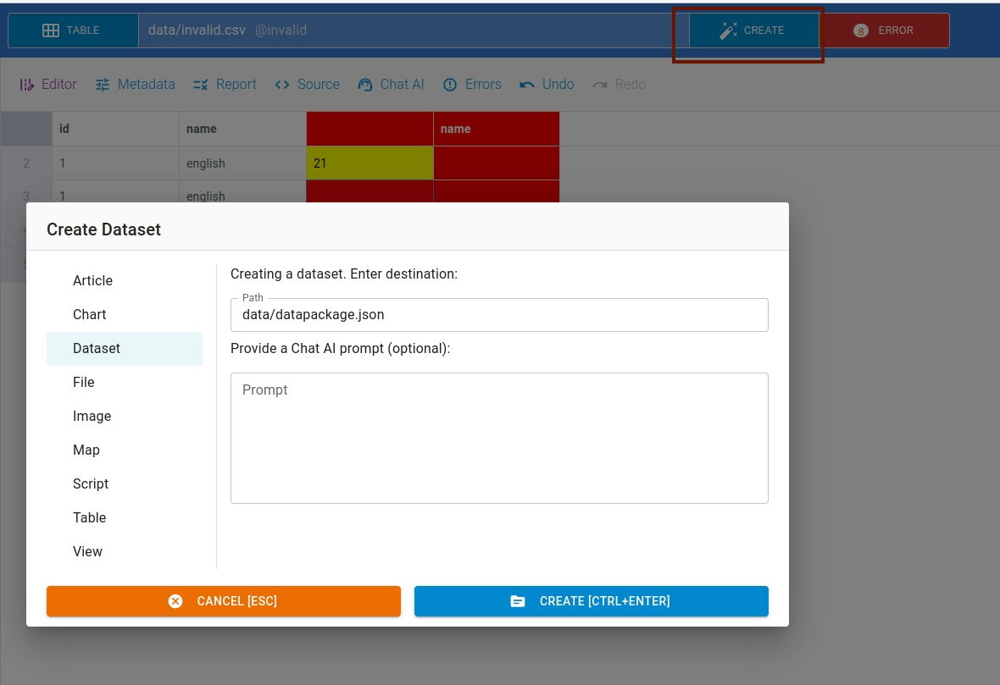
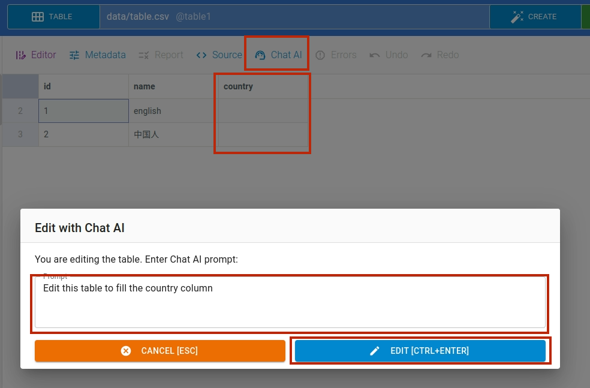
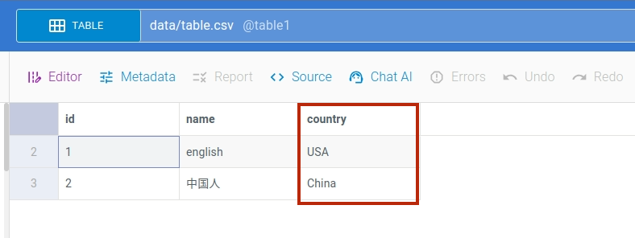

This section explains about how to work with tabular data in open data editor. Tabular data is structured as rows and columns, and each row represents an instance of the data and each column represents an attribute of that data.

## Adding and Opening Table

If you have a tabular data file for example table.csv then you can open the file by clicking table name in `File Explorer` on the left side of the editor. It supports other formats also, such as csv, xls, json etc.

If you haven't already added the file to the editor, click `ADD` button at the bottom left of the editor as shown below. It will open a file dialog to select the file to upload.

## Exploring Table

`Table Explorer` view of the editor displays data in the tabular format with attributes as columns and data as row.

It offers features like sorting, locking, automatic sizing, resizing and ability to show/hide columns etc, allowing the customization of table properties. To use these features, simply click on the `hamburger` button located in the top-right corner of each column.

## Source View

To view the file in its raw form, click on `source` menu. To hide, click on the menu again.

## Sorting / Pagination

You can sort rows by each column in either ascending or descending order. To access the sorting feature, simply click the column header and you will see up/down arrow for sorting.

The pagination at the bottom helps to navigate to different pages of the tabular data. You can also directly navigate to specific pages as well. Additionally, the refresh button allows you to reload the current page.

The `Results per page` dropdown button allows you to specify the numbers of rows you want to be displayed.

## Adding / Editing Metadata

You can edit the metadata of the tabular resource by clicking on `Metadata` menu in the toolbar. To hide the `Metadata` window, simply click the menu again.

The metadata editor provides a user friendly graphical interface to modify metadata such as licenses, contributors, dialect, schema etc. It has three sections: a menu explorer, an input form and a help window.

The help window, on the right side of metadata editor, displays info about each input element when selected. The metadata editor generates a resource specification for the selected tabular resource. The metadata adheres to the [Frictionless Data Standards](https://specs.frictionlessdata.io).

## Finding Errors

The editor applies [baseline checks](https://framework.frictionlessdata.io/docs/checks/baseline.html) to validate the data in the table resource. If any errors are detected, they will be displayed with a red background as shown in the figure below.

To view detailed error, simply click the `Report` menu. You will see the detailed description for each error at the bottom. To hide the `Report` window, simply click the menu again.

For table without errors, you will see a green background with a `VALID` check mark .

If you have large table with multiple pages, you can use `List Errors` feature in the editor to list all the errors in one place as shown below:

## Fixing Errors

To fix cell errors, you can directly edit the data cells in the viewer/editor. When you alter a cell's value, it changes to yellow, indicating a modified cell.

For schema changes, navigate to the `Schema Editor > Fields` menu within the `Metadata` menu.

To make other changes like headers, blank rows, etc., you can make direct edits to your files.

## Undo or Redo

You can undo or redo your last change using `undo` or `redo` feature in the `tools` menu.

## Saving or Reverting

You can modify the data by clicking in the table's cell and editing the content. The changes can be saved using `Save` button. When changes are made, the `Save` and `Revert` button gets activated at the bottom of the editor. If needed, you can revert the changes clicking the `Revert` button.

After making changes and validating the data, you can package the table resource(s) using the 'Data Package' feature. To create a package, navigate to 'Create' menu and select 'Dataset'. You have the option to either use the default package name or specify a custom name for the package file, then click the 'Create' button.

It will create a new file named '<your_file_name>.json' containing metadata for the package and its resources. The metadata adheres to the [Frictionless Data Standards](https://specs.frictionlessdata.io).

You can also make the changes to the package metadata. Your package is now ready for publishing.

## Publishing

To open the publishing window, click the `Publish` button located at the bottom of the package editor page. After you've added the CKAN details, click the `Publish` button to initiate the publishing process

Similarly, you can also publish it to `Zenodo` or `Github`

## Creating / Editing Tables Using AI

To generate data using AI, click `Create` button. A `Create File` dialog box will appear. Navigate to the `file` tab.

In `file` tab, input `filename` and write a data generation command in the `prompt` input box. We use OpenAI's `ChatGPT` large language model API.

Similarly, you can edit a table content by issuing command to AI. To access this window, select `Chat AI` option from the toolbar menu.

Enter your instruction to AI in the promt input box and apply the command by clicking the `EDIT` button. The resulting output is as follows:

